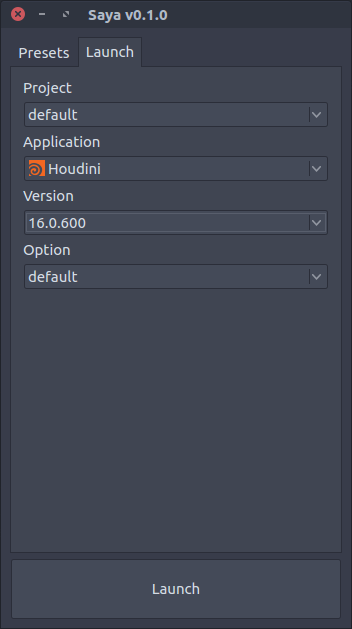

# Saya



## Feature

Saya is an application launcher especially for Digital Contents Creation tools. This launcher is able to handle project environments like plugin and packages environment variables and also application's version, launch options.

## Quick Start

Copy an paste.
Use command,
```bash
cd Saya/scripts
chmod +x launch.sh
./launch.sh
```

## Usage

### Saya Config

This tool has two type of config files.
- saya.config
    - As default, this tool has the one in _scripts_ folder.
- saya_presets.config

### Adding Application

To add new application on your environment, edit config/saya.config file or create new saya.config file at anywhere this tool can access.
If you create your custom saya.config file and placed other place except in _scripts_ folder, then set `SAYA_CONFIG_PATH` variables to the folder that contains saya.config file as launching.


### Supported OS

This tool currently supported only on Linux and Mac. Windows version will be released later.